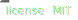
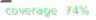
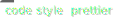

# [knex-rqlite](https://github.com/rqlite/knex-rqlite)

[](https://opensource.org/licenses/MIT)
[](https://www.npmjs.com/package/knex-rqlite)

[](https://prettier.io/)

Rqlite dialect for knex

---

## Usage

First install knex and knex-rqlite: `npm install knex rqlite-js knex-rqlite`

Then to use the driver like this:

```js
import Knex from "knex";
import { RqliteDialect, typeConfig } from "knex-rqlite";

const knex = Knex({
  client: RqliteDialect,
  connection: typeConfig({
    host: "localhost",
    port: 4001
  })
});
``` 

## Known problems

- This knex dialect **doesn't support transactions** yet
- Look into TODO.md to find a list of coming features

## E2E tests

The tests can be run with `./scripts/test.js`

**This requires a running rqlite server on port 4001 and will drop&change the table rqliteDialect-e2e**

## Building

`./scripts/build`
